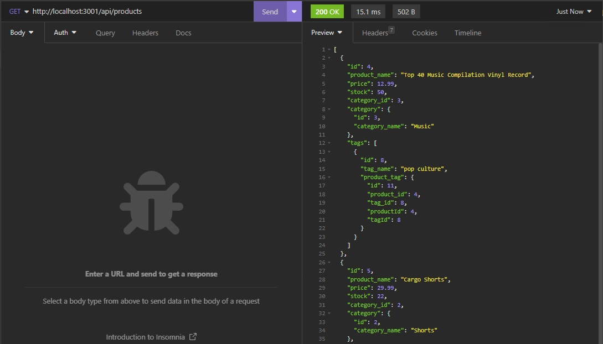
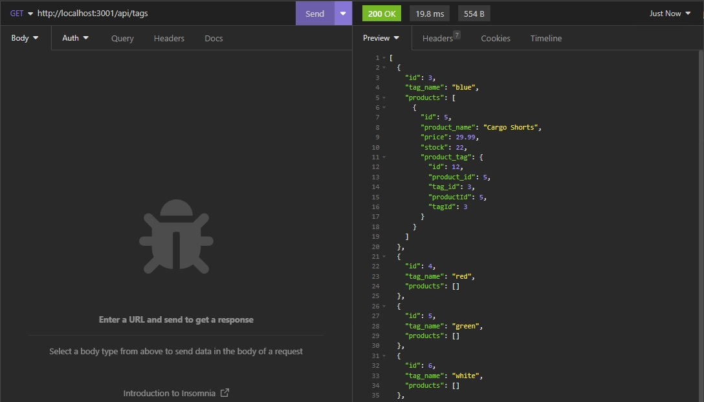
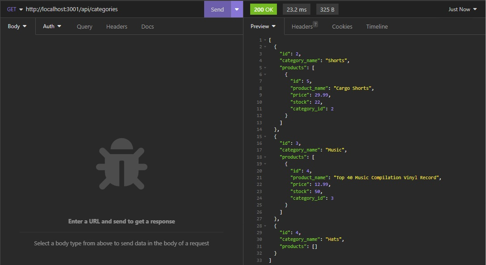

# E-Commerce-Backend
This is the backend for an e-commerce website, built with Node.js, Express.js, and Sequelize ORM. It allows users to perform CRUD (Create, Read, Update, Delete) operations on Products, Categories, and Tags.

[](https://opensource.org/licenses/MIT)

## Installation
To install this project, clone the repository to your local machine and run the following commands:

``` 
npm install
```
## Usage
To start the server, run the following command:
``` 
npm start
```
This will start the server on http://localhost:3001.

## Seed Databases by running:
``` 
npm start seed
```
This will load all databases with some test data
## The available routes are:

- /api/products: to get all products or create a new one.
- /api/products/:id: to get, update, or delete a specific product.
- /api/categories: to get all categories or create a new one.
- /api/categories/:id: to get, update, or delete a specific category.
- /api/tags: to get all tags or create a new one.
- /api/tags/:id: to get, update, or delete a specific tag.


## Screenshots

Products


Tags


Categories


## Skills on display
- MySQL 
  - select
  - delete
  - update
- GET/PUT/POST/DELETE API Routes

## Walkthrough Video
[Walkthrough Video](https://youtu.be/HVIoNLajwqA)